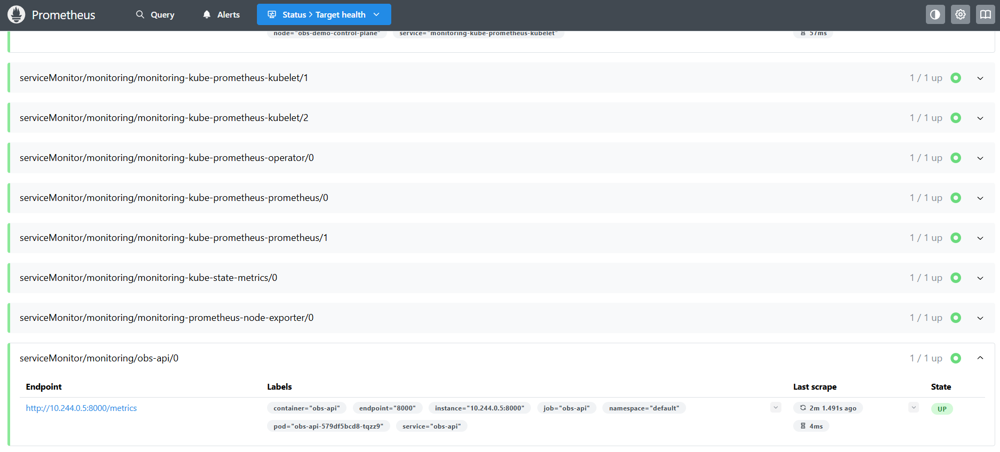
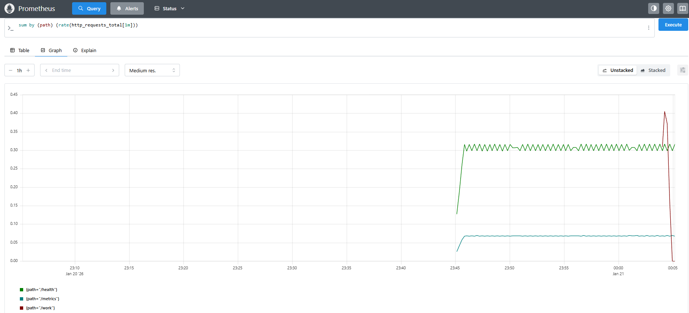
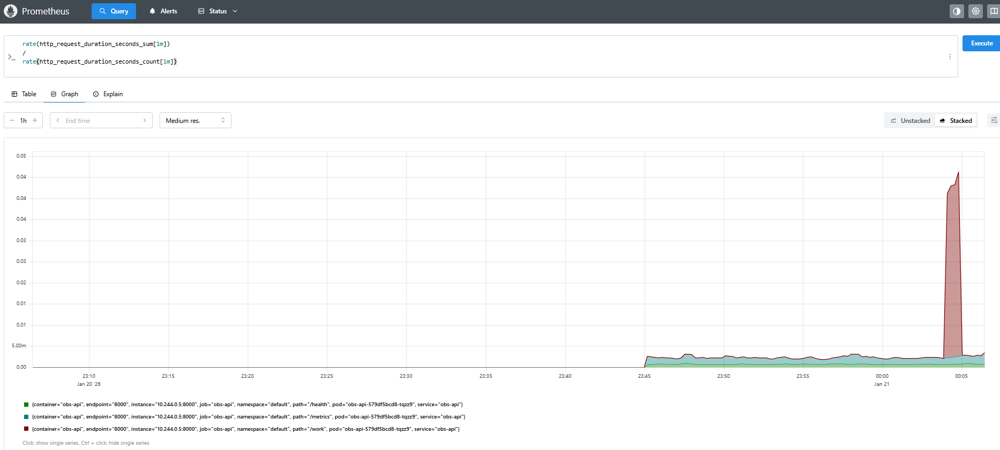
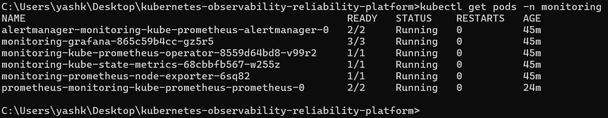

# Kubernetes Observability Platform (Local)

Local Kubernetes observability demo using kind, FastAPI, and Prometheus Operator.

This project demonstrates application metrics, Prometheus scraping via ServiceMonitor, and basic request rate and latency analysis using PromQL.

---

## Stack

- kind (local Kubernetes)
- FastAPI
- Prometheus (kube-prometheus-stack)
- ServiceMonitor

---

## Setup

```bash
kind create cluster --name obs-demo

docker build -t obs-api:1.0 ./services/api
kind load docker-image obs-api:1.0 --name obs-demo

kubectl apply -f k8s/api.yaml

kubectl create namespace monitoring
helm repo add prometheus-community https://prometheus-community.github.io/helm-charts
helm repo update
helm install monitoring prometheus-community/kube-prometheus-stack -n monitoring

kubectl apply -f k8s/servicemonitor.yaml
```

---

## Verify Prometheus Scraping

```bash
kubectl port-forward -n monitoring svc/monitoring-kube-prometheus-prometheus 9090:9090
```

Open in browser:
```
http://localhost:9090/targets
```

Target should show **UP**.



---

## Generate Traffic

```bash
kubectl port-forward svc/obs-api 8000:8000
curl "http://localhost:8000/work?ms=50"
```

---

## Metrics
More PromQL examples: `prometheus/queries.promql`
### HTTP Request Rate

```promql
sum by (path) (rate(http_requests_total[1m]))
```



---

### Average HTTP Request Latency (seconds)

```promql
rate(http_request_duration_seconds_sum[1m])
/
rate(http_request_duration_seconds_count[1m])
```



---

## Monitoring Stack Status

```bash
kubectl get pods -n monitoring
```



---

## Cleanup

```bash
helm uninstall monitoring -n monitoring
kubectl delete namespace monitoring
kind delete cluster --name obs-demo


## Notes

- /ready endpoint fails without Redis (intentional readiness behavior)
- On Windows, prefer Prometheus UI over findstr

**## Troubleshooting**

- Prometheus UI not opening: re-run the port-forward to 9090 (it stops if the pod restarts).
- curl localhost:8000 failing: ensure `kubectl port-forward svc/obs-api 8000:8000` is running.
- Prometheus target missing: confirm ServiceMonitor labels match the Service (`app: obs-api`) and ServiceMonitor `release: monitoring`.
